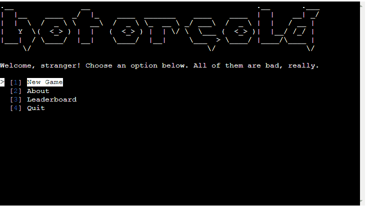

# HOT OR COLD

Want to play a game? If you've answered 'no', you might be in the wrong place.

Our game is called 'Hot or Cold'. 

You know the drill, the point of the game is to guess a number.

Our target audience are any users with access to the Internet, a bit of a free time, some sense of humour...
...and appreciation for an occasional pop-cultural reference.

Because why? Because we might have hidden a few throughout our sassy game.

Our game is deployed on [Heroku](https://hot---or---cold-1a720aba2d56.herokuapp.com/) and [Render](https://hot-or-cold.onrender.com/).

## UX

### Colour Scheme

Colour scheme is simple:
Color is used to emphasise information for the user.

- `#FF0000` used for invalid information entered.
- `#FFFF00` user a reminder of the previous guesses within the game.
- `#00FF00` used as main informational color.
- `#FFFFFF` used as main informational color.

I used [coolors.co](https://coolors.co/ff0000-ffff00-00ff00-ffffff) to generate my colour palette:

## Flowchart

I used [lucidchart.app](https://lucid.app/) to create a flowchart of the project:

## Features

### Existing Features

- **Header**

    - Our game has a header which first welcomes the player to our realm.

- **Menu**

    - Our menu is clear and elegant.

- **Difficulty levels**

    - User can choose their difficulty level.

- **Scoreboard input**

    - User can choose to attempt to score a position in the scoreboard.

- **Scoreboard output**

    - User can choose to see scoreboard depending on the difficulty to know what they should be aiming for.

- **Scoreboard output - colored**

    - If the user won the game and scored a position on the leaderboard, their line will be emphasised with a green color.

- **About section**

    - User can choose to read up on the game.

- **Username input**

    - User can choose their username. Username will be validated.

- **Input validation**

    - User will be notified if their input is invalid and prompted for another attempt.

- **Guess output**

    - User will receive feedback on their guess within the game.

- **Guess reminder**

    - User has access to their previous guesses so they don't have to memorise it.

- **Play again?**

    - When viewing the scoreboard, user will be asked if they want to play again. This will only happen if the user finished the game before this.

- **Quit game**

    - User can choose to quit the game. The game will thank them for their participation.

- **Score calculation**

    - Score equals to the amount of player's guesses. It is used to compare user's result to others' on the scoreboard.

- **Game won confirmation**

    - Once player guesses the correct number, they will be notified and prompted to choose if they want to attempt to add their name to the scoreboard.

- **Shortcuts**

    - Our menu contains shortcuts, easily visible and accessible to the user.

- **Re-playability**

    - When launching the game, the number user needs to guess will be randomly chosen, allowing for countless plays.

- **Colors**

    - Colors are used within the game for the sole purpose of emphasising information.

### Future Features

- Statement expansion
    - We would like to add more statements used for randomisation to boost CX.
- Different modes
    - Ideally, user should be able to choose the level of game's sassiness.
    - User should be able to set the game parameters, such as having to guess numbers between X and Y or to be guessing letters instead of numbers.

## Tools & Technologies Used

- [Git](https://git-scm.com) used for version control. (`git add`, `git commit`, `git push`)
- [GitHub](https://github.com) used for secure online code storage.
- [Heroku](https://www.heroku.com/) used for hosting the deployed front-end site.
- [Render](https://render.com/) used for secondary hosting and deployment of the front-end site.
- [Codeanywhere](https://app.codeanywhere.com) used as a cloud-based IDE for development.
- [LucidChart](https://lucid.app/) to create the flowchart used within README.
- [Coolors](https://coolors.co/) to create a color palette used within README.
- [Google API](https://cloud.google.com/apis/) to create an API used for communication and data transfer.
- [Google Sheets](https://www.google.com/sheets/about/) used to create a spreadsheet used to track highscores.
- [gspread](https://docs.gspread.org/en/v5.10.0/) used to access & add data to the [spreadsheet](https://docs.google.com/spreadsheets/d/1M4C6Bt9I8-Z1FVmuhbb_J4ridbD_wYYEfWBNhsJmj1c/edit?usp=sharing).
- [art](https://pypi.org/project/art/) used to generate game name and goodbye message by utilising tprint.
- [simple-term-menu](https://pypi.org/project/simple-term-menu/) used to create menus throughout the game.
- [time](https://docs.python.org/3/library/time.html) used to delay printing.
- [colorama](https://pypi.org/project/colorama/) used to print in color.
- [sys](https://docs.python.org/3/library/sys.html) used to assist with delayed print.
- [os](https://docs.python.org/3/library/os.html) used in clearing the terminal.
- [CI Linter](https://pep8ci.herokuapp.com/#) used to validate code throughout .py files.
- [ScreenToGif](https://www.screentogif.com/) used in creation of README.

## Testing

For all testing, please refer to the [TESTING.md](TESTING.md) file.

## Deployment

The site was deployed to both Heroku and Render. Render was initially used due to account creation issues with Heroku, followed by Heroku's tech issues with inputting billing details.

### Heroku

The steps to deploy on Heroku are as follows:
- Fork or clone the repository.
- Create a new Heroku app.
- Choose app name and region.
- Via Google Cloud, obtain credentials for Google Drive and Google Sheets APIs.*
- Upload credentials file to your environment, name it `creds.json` and add it to `.gitignore`.
- Access Settings, followed by Config Vars; add (key) `Port` and (value) `8000`. 
- Add (key) `CREDS` and (value) contents of `creds.json`.
- Set a buildback to Python and NodeJS in that order.
- Connect the Heroku app to the repository by authorising access.
- Enable automatic deploys (optional), deploy manually.

The live link can be found [here](https://hot---or---cold-1a720aba2d56.herokuapp.com/).

### Render

The steps to deploy on Render are as follows:
- Fork or clone the repository.
- Create a new Render web service.
- Connect the repository to Render.
- Choose service name and region.
- Via Google Cloud, obtain credentials for Google Drive and Google Sheets APIs.*
- Upload credentials file to your environment, name it `creds.json` and add it to `.gitignore`.
- Select environment.
- Add Render build command: `pip3 install -r requirements.txt`.
- Add Render start command: `node index.js`.
- Choose "Free Plan" followed by "Advanced Settings". 
- Choose "Add Environment Variable".
- Add (key) `CREDS` and (value) contents of `creds.json`.
- Add (key) `PORT` and (value) 8000. 
- Add (key) `PYTHON_VERSION` and (value) `3.10.7`.
- Enable automatic deploys (optional), deploy manually by clicking "Create Web Service".

The live link can be found [here](https://hot-or-cold.onrender.com/)

*Spreadsheet creation:
- Create a spreadsheet with 3 worksheets, "beginner", "intermediate", "expert".
- Add headers for the first 2 columns in each worksheet: "Username", "Guesses" (feel free to change wording).
- Add the name of your spreadsheet to SHEET constant variable in `run.py`.
- Copy the contents of `client_email` from `creds.json` and share editing access of the spreadsheet with said email address. Choose not to notify recipient.

### Local Deployment

This project can be cloned or forked in order to make a local copy on your own system.

#### Cloning

You can clone the repository by following these steps:

1. Go to the [GitHub repository](https://github.com/josipcodes/hot-or-cold). 
2. Locate the Code button above the list of files and click it.
3. Select if you prefer to clone using HTTPS, SSH, or GitHub CLI and click the copy button to copy the URL to your clipboard.
4. Open Git Bash or Terminal.
5. Change the current working directory to the one where you want the cloned directory.
6. In your IDE Terminal, type the following command to clone my repository:
	- `git clone https://github.com/josipcodes/hot-or-cold.git`
7. Press Enter to create your local clone.

Alternatively, if using Gitpod, you can click below to create your own workspace using this repository.

Please note that in order to directly open the project in Gitpod, you need to have the browser extension installed.
A tutorial on how to do that can be found [here](https://www.gitpod.io/docs/configure/user-settings/browser-extension).

#### Forking

By forking the GitHub Repository, we make a copy of the original repository on our GitHub account to view and/or make changes without affecting the original owner's repository.
You can fork this repository by using the following steps:

1. Log in to GitHub and locate the [GitHub Repository](https://github.com/josipcodes/hot-or-cold)
2. At the top of the Repository (not top of page) just above the "Settings" Button on the menu, locate the "Fork" Button.
3. Once clicked, you should now have a copy of the original repository in your own GitHub account!

### Local VS Deployment

There are no known differences between the local version developed, and the live deployment site on Heroku/Render.

## Credits

Below resources were used in the creation of the game.

### Code

| Source | Location | Notes |
| --- | --- | --- |
| [Python-Programs](https://python-programs.com/python-how-to-find-an-element-in-tuple-by-value/) | leaderboard.py | Find value in a tuple |
| [Github](https://gist.github.com/gnuton/3c7a46447d2be0aee0b2) | leaderboard.py | slow print |
| [GeeksForGeeks](https://www.geeksforgeeks.org/clear-screen-python/) | throughout the project | clearing terminal |
| [Github](https://github.com/Code-Institute-Solutions/love-sandwiches-p5-sourcecode/tree/master) | run.py | API set up, declaring related variables |
| [python.org](https://docs.python.org/3/library/random.html) | run.py | randomisation of statements, numbers |
| [Stackoverflow](https://stackoverflow.com/questions/26069864/traceback-most-recent-call-last-error-in-python) | troubleshooting | traceback error |
| [Youtube](https://www.youtube.com/watch?v=Zpa-rc9e388) | run.py | menu creation tutorial |
| [FreeCodeCamp](https://www.freecodecamp.org/news/python-sort-list-how-to-order-by-descending-or-ascending/) | run and leaderboard.py | sort method |
| [Stackoverflow](https://stackoverflow.com/questions/10897339/fetch-first-10-results-from-a-list-in-python) | leaderboard.py |fetching top 10 results from a list |
| [TutorialKart](https://www.tutorialkart.com/python/python-range/python-if-in-range/#gsc.tab=0) | run and leaderboard.py |range check |
| [Stackoverflow](https://stackoverflow.com/questions/4172448/is-it-possible-to-break-a-long-line-to-multiple-lines-in-python) | throughout the project | breaking strings multiline |
| [DelftStack](https://www.delftstack.com/howto/python/python-print-column-alignment/) | leaderboard.py | print alignment |
| [GeeksForGeeks](https://www.geeksforgeeks.org/string-alignment-in-python-f-string/) | leaderboard.py | f-strings |
| [Stackoverflow](https://stackoverflow.com/questions/744373/what-happens-when-using-mutual-or-circular-cyclic-imports) | troubleshooting | circular imports |
| [GeeksForGeeks](https://www.geeksforgeeks.org/python-program-to-convert-a-list-to-string/) | run.py | list to string conversion |
| [Stackoverflow](https://stackoverflow.com/questions/9777122/why-does-sort-cause-the-list-to-be-none-in-python) |troubleshooting | Sort returning None |
| [Stackoverflow](https://stackoverflow.com/questions/26987222/checking-whitespace-in-a-string-python) | leaderboard.py | isspace() |
| [Github](https://github.com/lexach91/algorithm-visualizer#render-deployment) | README | deployment steps |

### Content

| Source | Location | Notes |
| --- | --- | --- |
| [Genius](https://genius.com/Julie-andrews-my-favorite-things-lyrics) |statements.py | Julie Andrews - My Favorite Things lyrics |
| [IMDb](https://www.imdb.com/title/tt0212346/) | statements.py | Miss Congeniality quotes |

### Media

Several emojis were used in print statements to boost user experience and provide feedback.

| Source | Location | Type | Notes |
| --- | --- | --- | --- |
| [Emojipedia](https://emojipedia.org/four-leaf-clover/) | print statement | emoji | Four leaf clover |
| [Emojipedia](https://emojipedia.org/fire/) | print statement | emoji | Fire |
| [Emojipedia](https://emojipedia.org/snowman/) | print statement | emoji | Snowman |

### Acknowledgements

- I would like to thank my Code Institute mentor, [Alex](https://github.com/lexach91) for their support throughout the development of this project.
- I need to thank [Codewars](https://www.codewars.com); as their katas further helped in understanding Python. 
- I want to thank Iva for play-testing the game post-deployment.
