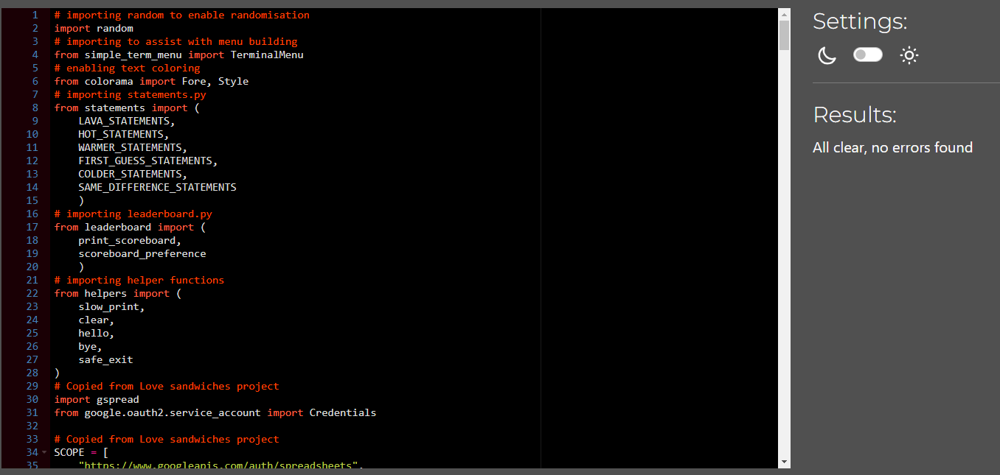
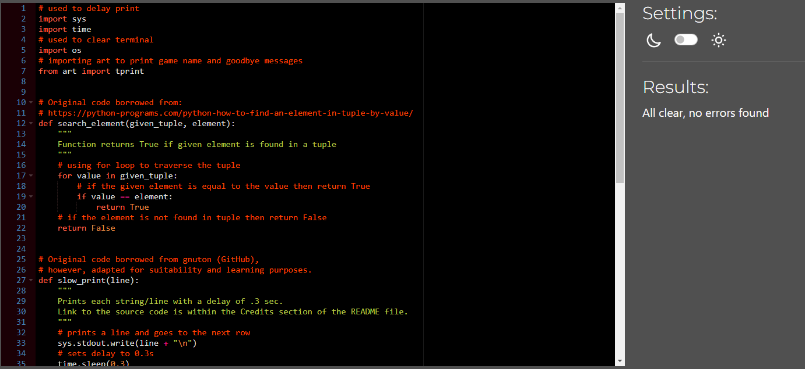

# Testing

Return back to the [README.md](README.md) file.

## Testing

### PEP8

No issues were found during PEP8 testing, however, I am aware that this might change due to GitHub's tendency to trim the empty line at the end of each document.

**run.py**

**statements.py**

**leaderboard.py**

**helpers.py**

### Manual Testing

| Location | Action | Expected Result | Pass/Fail | Comments |
| --- | --- | --- | --- | --- |
| Initial Screen | | | | |
| | | Game name prints | Pass | |
| | | Initial message prints | Pass | |
| | | Main Menu prints | Pass | |
| | Press Enter on New Game | Difficulty Menu prints | Pass | |
| | Press 1 | Difficulty-menu prints | Pass | |
| | Press Enter on About | About Section prints | Pass | |
| | Press 2 | About Section prints | Pass | |
| | Press Enter on Leadeboard | Leaderboard Menu prints | Pass | |
| | Press 3 | Leaderboard-menu prints | Pass | |
| | Press Enter on Quit Game | Quit Menu prints | Pass | |
| | Press 4 | Quit-menu prints | Pass | |
| | Press non-specified key | No action | Pass | |

| Location | Action | Expected Result | Pass/Fail | Comments |
| --- | --- | --- | --- | --- |
| Difficulty Menu | | | | |
| | | Initial message prints | Pass | |
| | | Difficulty Menu prints | Pass | |
| | Press Enter on Beginner | Beginner mode is initialised | Pass | mode can be recognised by the message stating the range within user is to guess |
| | Press 1 | Beginner mode is initialised | Pass | mode can be recognised by the message stating the range within user is to guess |
| | Press Enter on Intermediate | Intermediate mode is initialised | Pass | mode can be recognised by the message stating the range within user is to guess |
| | Press 2 | Intermediate mode is initialised | Pass | mode can be recognised by the message stating the range within user is to guess |
| | Press Enter on Expert | Expert mode is initialised | Pass | mode can be recognised by the message stating the range within user is to guess |
| | Press 3 | Expert mode is initialised | Pass | mode can be recognised by the message stating the range within user is to guess |
| | Press Enter on Go back | Initial Screen prints | Pass | |
| | Press 4 | Initial Screen prints | Pass | |
| | Press non-specified key | No action | Pass | |

| Location | Action | Expected Result | Pass/Fail | Comments |
| --- | --- | --- | --- | --- |
| About Section | | | | |
| | | About Section prints | Pass | |
| | | Return option prints | Pass | |
| | Press Enter on return option | Initial Screen prints | Pass | |
| | Press r/R | Initial Screen prints | Pass | |

| Location | Action | Expected Result | Pass/Fail | Comments |
| --- | --- | --- | --- | --- |
| Leaderboard Menu | | | | |
| | | Initial message prints | Pass | |
| | | Leaderboard menu prints | Pass | |
| | Press Enter on Beginner | Beginner leaderboard is printed slowly | Pass | |
| | Press 1 | Beginner leaderboard is printed slowly | Pass | |
| | Press Enter on Intermediate | Intermediate leaderboard is printed slowly | Pass | |
| | Press 2 | Intermediate leaderboard is printed slowly | Pass | |
| | Press Enter on Expert | Expert leaderboard is printed slowly | Pass | |
| | Press 3 | Expert leaderboard is printed slowly | Pass | |
| | Press Enter on Go back | Initial Screen prints | Pass | |
| | Press 4 | Initial Screen prints | Pass | |
| | Press Enter on Go back | Initial Screen prints | Pass | |
| | Press Enter on return option | Initial Screen prints | Pass | |
| | Press r/R | Initial Screen prints | Pass | |
| | Press non-specified key | No action | Pass | |
| | | No printed lines are green | Pass | |
| | Game won | Leaderboard prints slowly | Pass | |
| | Game won | User's line is printed green if on the board | Pass | |
| | Game won | Play again Section prints | Pass | |

| Location | Action | Expected Result | Pass/Fail | Comments |
| --- | --- | --- | --- | --- |
| Quit Menu | | | | |
| | | Initial message prints | Pass | |
| | | Quit Menu prints | Pass | |
| | Press Enter on Yes | Goodbye message prints | Pass | |
| | Press y/Y | Goodbye message prints | Pass | |
| | Press Enter on No | Return to menu and return option print | Pass | |
| | Press n/N | Return to menu and return option print | Pass | |
| | Press Enter on return option | Initial Screen prints | Pass | |
| | Press r/R | Initial Screen prints | Pass | |

| Location | Action | Expected Result | Pass/Fail | Comments |
| --- | --- | --- | --- | --- |
| In-game | | | | |
| | | Initial message prints | Pass | Range is confirmed in the message |
| | | Input request prints | Pass | |
| | Enter non-number | Warning prints, input requested again | Pass | |
| | Enter number outside of range | Warning prints, input requested again | Pass | |
| | Enter wrong number | Feedback provided, input requested again | Pass | |
| | | Previous wrong guesses printed in yellow | Pass | |
| | Enter correct number | Feedback provided | Pass | |
| | Game won | Question to add name to scoreboard prints, menu prints | Pass | |
| | Press Enter on Yes | Goodbye message prints | Pass | |
| | Press y/Y | Goodbye message prints | Pass | |
| | Press Enter on No | Play again Section prints | Pass | |
| | Press n/N | Play again Section prints | Pass | |
| | Leaderboard participation confirmed | Input request prints | Pass | |
| | Enter too short username | Warning prints, input requested again | Pass | |
| | Enter too long username | Warning prints, input requested again | Pass | |
| | Enter blank username | Warning prints, input requested again | Pass | |
| | Enter username | Leaderboard Game Won scenario initialised | Pass | |

| Location | Action | Expected Result | Pass/Fail | Comments |
| --- | --- | --- | --- | --- |
| Play again Section | | | | |
| | | Initial message prints | Pass | |
| | | Play again Menu prints | Pass | |
| | Press Enter on Yes | Difficulty Menu prints | Pass | |
| | Press y/Y | Difficulty Menu prints | Pass | |
| | Press Enter on No | Quit Menu prints | Pass | |
| | Press n/N | Quit Menu prints | Pass | |

## Bugs

**Fixed Bugs**

- When playing again after a won game, previous choices wouldn't be set to 0, resulting in incorrect score at the end of the round.

    - To fix this, I have included `player_guesses.clear()` within `run_game()` to flush out the previously stored data.

- Simple-term-menu uses 'q' and 'Escape' keys as escape sequences. As a result, although not manifested as options within my menus, these buttons would cause a crash when used within menus.

    

    - To fix this, I have surrounded my `if-elif` statements within `main()` with `try-except TypeError`, however, this caused `CTRL+C` not to perform as it would be read as `TypeError` when within menu. 
    - Since preventing exit would be a bad practice, I have attempted to use `pynput` to read keyboard events in order to handle `CTRL+C` specific events, however, even after updating pynput I kept receiving the following error:

        `Traceback (most recent call last):`
    `File "run.py", line 10, in <module>`
        `from pynput import keyboard`
    `File "/home/codeany/.local/lib/python3.8/site-packages/pynput/__init__.py", line 40, in <module>`
        `from . import keyboard`
    `File "/home/codeany/.local/lib/python3.8/site-packages/pynput/keyboard/__init__.py", line 31, in <module>`
        `backend = backend(__name__)`
    `File "/home/codeany/.local/lib/python3.8/site-packages/pynput/_util/__init__.py", line 76, in backend`
        `raise ImportError('this platform is not supported: {}'.format(`
    `ImportError: this platform is not supported: ('failed to acquire X connection: Bad display name ""', DisplayNameError(''))`

    - After a short discussion with the Tutor team, I have come to understand that `quit_keys` within `simple-term-menus` can be changed from their defaults. 
    
    - As a final solution, I have left `try-except TypeError` although I'm conscious the solution would work without it. The current solution is to call `safe_exit()` which runs `sys.exit()` when within the menu.

**Unfixed Bugs**

- To my knowledge, there are no unfixed bugs.

    